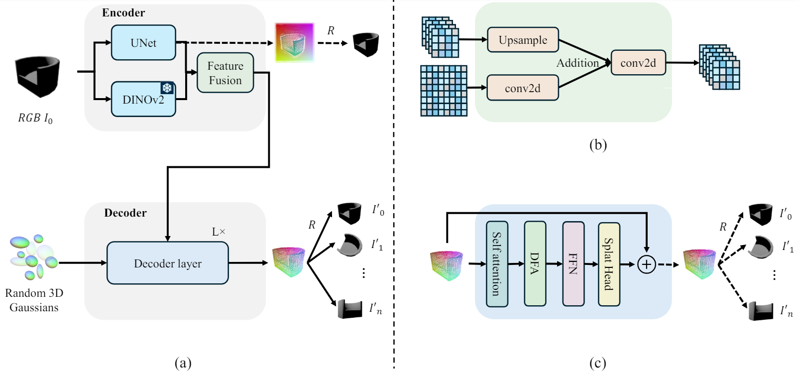

# LeanGaussian: Breaking Pixel or Point Cloud Correspondence in Modeling 3D Gaussians
The code for this project will be available soon. Stay tuned for updates!

[Project Page](https://kenkunliu.github.io/DIG3D/) | [Arxiv](https://arxiv.org/abs/2404.16323)



Open-category 3D object reconstruction from a single-view image in real time


https://github.com/user-attachments/assets/ce5a47e6-a1fc-4f8f-800e-d312ea6d8ab5


## Citation

If you find our work useful in your research, please consider citing:
```bibtex
@article{wu2024dig3d,
  title={LeanGaussian: Breaking Pixel or Point Cloud Correspondence in Modeling 3D Gaussians},
  author={Wu, Jiamin and Liu, Kenkun and Gao, Han and Jiang, Xiaoke and Zhang, Lei},
  journal={arXiv preprint arXiv:2404.16323},
  year={2024}
}
```
Please also check our another project for random number of input image reconstruction [UNIG](https://arxiv.org/abs/2410.13195)). The code will also be released soon.
```bibtex
@article{wu2024unig,
  title={UniG: Modelling Unitary 3D Gaussians for View-consistent 3D Reconstruction},
  author={Wu, Jiamin and Liu, Kenkun and Shi, Yukai and Jiang, Xiaoke and Yao, Yuan and Zhang, Lei},
  journal={arXiv preprint arXiv:2410.13195},
  year={2024}
}
